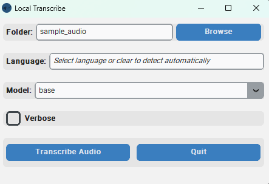

## Local Transcribe with Whisper 
Local Transcribe with Whisper is a user-friendly desktop application that allows you to transcribe audio and video files using the Whisper ASR system. This application provides a graphical user interface (GUI) built with Python and the Tkinter library, making it easy to use even for those not familiar with programming.

## New in version 1.2!
1. Simpler usage:
    1. File type: You no longer need to specify file type. The program will only transcribe elligible files.
    2. Language: Added option to specify language, which might help in some cases. Clear the default text to run automatic language recognition.
    3. Model selection: Now a dropdown option that includes most models for typical use. 
2. New and improved GUI.  


## Features
* Select the folder containing the audio or video files you want to transcribe. Tested with m4a video. 
* Choose the language of the files you are transcribing. You can either select a specific language or let the application automatically detect the language.
* Select the Whisper model to use for the transcription. Available models include "base.en", "base", "small.en", "small", "medium.en", "medium", and "large". Models with .en ending are better if you're transcribing English, especially the base and small models.
* Enable the verbose mode to receive detailed information during the transcription process.
* Monitor the progress of the transcription with the progress bar and terminal. 
* Confirmation dialog before starting the transcription to ensure you have selected the correct folder.
* View the transcribed text in a message box once the transcription is completed.

## Installation
### Get the files
Download the zip folder and extract it to your preferred working folder.  
  
Or by cloning the repository with:
```
git clone https://github.com/soderstromkr/transcribe.git
```
### Python Version **(any platform including Mac users)**
1. This script was made and tested in an Anaconda environment with Python 3.10. I recommend miniconda for a smaller installation, and if you're not familiar with Python.
See [here](https://docs.anaconda.com/free/miniconda/miniconda-install/) for instructions. You will **need administrator rights**. 
2. Whisper also requires some additional libraries. The [setup](https://github.com/openai/whisper#setup) page states: "The codebase also depends on a few Python packages, most notably HuggingFace Transformers for their fast tokenizer implementation and ffmpeg-python for reading audio files."
Users might not need to specifically install Transfomers. However, a conda installation might be needed for ffmpeg[^1], which takes care of setting up PATH variables.

From the Anaconda Prompt (which should now be installed in your system, find it with the search function), type or copy the following:
```
conda install -c conda-forge ffmpeg-python
```
You can also choose not to use Anaconda (or miniconda), and use Python. In that case, you need to [download and install FFMPEG](https://ffmpeg.org/download.html) (and potentially add it to your PATH). See here for [WikiHow instructions](https://www.wikihow.com/Install-FFmpeg-on-Windows)

3. The main functionality comes from openai-whisper. See their [page](https://github.com/openai/whisper) for details. It also uses some additional packages (colorama, and customtkinter), install them with the following command:
```
pip install -r requirements.txt
```
4. Run the app: 
    1. For **Windows**: In the same folder as the *app.py* file, run the app from Anaconda prompt by running
```python app.py```
or with the batch file called run_Windows.bat (for Windows users), which assumes you have conda installed and in the base environment (This is for simplicity, but users are usually adviced to create an environment, see [here](https://conda.io/projects/conda/en/latest/user-guide/tasks/manage-environments.html#creating-an-environment-with-commands) for more info) just make sure you have the correct environment (right click on the file and press edit to make any changes). 
    3. For **Mac**: Haven't figured out a better way to do this, see [the instructions here](Mac_instructions.md)

    **Note** If you want to download a model first, and then go offline for transcription, I recommend running the model with the default sample folder, which will download the model locally. 
## Usage
1. When launched, the app will also open a terminal that shows some additional information.
2. Select the folder containing the audio or video files you want to transcribe by clicking the "Browse" button next to the "Folder" label. This will open a file dialog where you can navigate to the desired folder. Remember, you won't be choosing individual files but whole folders!
3. Enter the desired language for the transcription in the "Language" field. You can either select a language or leave it blank to enable automatic language detection.
4. Choose the Whisper model to use for the transcription from the dropdown list next to the "Model" label.
5. Enable the verbose mode by checking the "Verbose" checkbox if you want to receive detailed information during the transcription process.
6. Click the "Transcribe" button to start the transcription. The button will be disabled during the process to prevent multiple transcriptions at once.
7. Monitor the progress of the transcription with the progress bar.
8. Once the transcription is completed, a message box will appear displaying the transcribed text. Click "OK" to close the message box.
9. You can run the application again or quit the application at any time by clicking the "Quit" button.

## Jupyter Notebook
Don't want fancy EXEs or GUIs? Use the function as is. See [example](example.ipynb) for an implementation on Jupyter Notebook.

[^1]: Advanced users can use ```pip install ffmpeg-python``` but be ready to deal with some [PATH issues](https://stackoverflow.com/questions/65836756/python-ffmpeg-wont-accept-path-why), which I encountered in Windows 11.

[](https://zenodo.org/badge/latestdoi/617404576)
