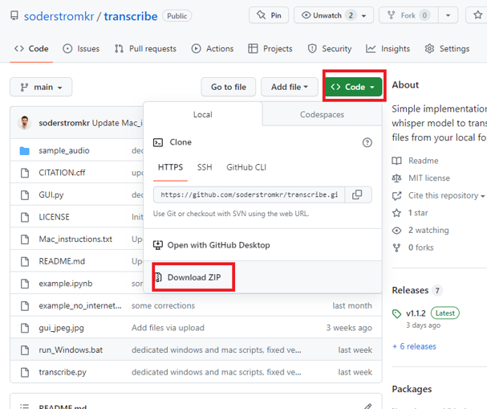

## Local Transcribe with Whisper 

> **⚠ Note for Mac users (Apple Silicon):** This version uses `faster-whisper` (CTranslate2), which does **not** support Apple M-chip GPU acceleration. Transcription will run on CPU, which is slower than OpenAI's Whisper with Metal/CoreML support. The trade-off is a much simpler installation — no conda, no PyTorch, no admin rights. If you'd prefer M-chip GPU acceleration and don't mind a more involved setup, switch to the [**classic**](https://github.com/soderstromkr/whisper-local-transcribe/releases/tag/classic) release:
> ```
> git checkout classic
> ```

Local Transcribe with Whisper is a user-friendly desktop application that allows you to transcribe audio and video files using the Whisper ASR system, powered by [faster-whisper](https://github.com/SYSTRAN/faster-whisper) (CTranslate2). This application provides a graphical user interface (GUI) built with Python and the Tkinter library, making it easy to use even for those not familiar with programming.

## New in version 2.0!
1. **Switched to faster-whisper** — up to 4× faster transcription with lower memory usage, simpler installation.
2. **Swedish-optimised models** — [KB-Whisper](https://huggingface.co/collections/KBLab/kb-whisper) from the National Library of Sweden (KBLab)
3. **No separate FFmpeg installation needed** — audio decoding is handled by the bundled PyAV library.
4. **No admin rights required** — a plain `pip install` covers everything.
5. **No PyTorch dependency** — dramatically smaller install footprint.
6. **Integrated console** - all info in the same application.
7. **`tiny` model added** — smallest and fastest option.


## Features
* Select the folder containing the audio or video files you want to transcribe. Tested with m4a video. 
* Choose the language of the files you are transcribing. You can either select a specific language or let the application automatically detect the language.
* Select the Whisper model to use for the transcription. Available models include "tiny", "tiny.en", "base", "base.en", "small", "small.en", "medium", "medium.en", "large-v2", and "large-v3". Models with .en ending are better if you're transcribing English, especially the base and small models.
* **Swedish-optimised models** — [KB-Whisper](https://huggingface.co/collections/KBLab/kb-whisper) from the National Library of Sweden (KBLab) is available in all sizes (tiny → large). These models reduce Word Error Rate by up to 47 % compared to OpenAI Whisper on Swedish speech. The language is set to Swedish automatically when a KB model is selected.
* Enable the verbose mode to receive detailed information during the transcription process.
* Monitor the progress of the transcription with the progress bar and terminal. 
* Confirmation dialog before starting the transcription to ensure you have selected the correct folder.
* View the transcribed text in a message box once the transcription is completed.

## Installation
### Get the files
Download the zip folder and extract it to your preferred working folder.  
  
Or by cloning the repository with:
```
git clone https://github.com/soderstromkr/transcribe.git
```
### Prerequisites
Install **Python 3.10 or later**. Some IT policies allow installing from the Microsoft Store or Mac equivalent. However, I would prefer an install from [python.org](https://www.python.org/downloads/). During installation, **check "Add Python to PATH"**. No administrator rights are needed if you install for your user only.

### Run on Windows
Double-click `run_Windows.bat` — it will auto-install everything on first run.

### Run on Mac / Linux
Run `./run_Mac.sh` — it will auto-install everything on first run. See [Mac instructions](Mac_instructions.md) for details.

> **Note:** The first run with a given model will download it (~75 MB for base, ~500 MB for medium). After that, everything works offline.

### Manual installation (if the launchers don't work)
If `run_Windows.bat` or `run_Mac.sh` fails (e.g. Python isn't on PATH, or permissions issues), open a terminal in the project folder and run these steps manually:
```
python -m venv .venv
```
Activate the virtual environment:
- **Windows:** `.venv\Scripts\activate`
- **Mac / Linux:** `source .venv/bin/activate`

Then install and run:
```
python install.py
python app.py
```

## GPU Support
This program **does support running on NVIDIA GPUs**, which can significantly speed up transcription times. faster-whisper uses CTranslate2, which requires NVIDIA CUDA libraries for GPU acceleration.

### Automatic Detection
The `install.py` script **automatically detects NVIDIA GPUs** and will ask if you want to install GPU support. If you skipped it during installation, you can add it anytime:
```
pip install nvidia-cublas-cu12 nvidia-cudnn-cu12
```

**Note:** Make sure your NVIDIA GPU drivers are up to date. You can check by running `nvidia-smi` in your terminal. The program will automatically detect and use your GPU if available, otherwise it falls back to CPU.

### Verifying GPU Support
After installation, you can verify that your GPU is available by running:
```python
import ctranslate2
print(ctranslate2.get_supported_compute_types("cuda"))
```
If this returns a list containing `"float16"`, GPU acceleration is working.

## Usage
1. Launch the app — the built-in console panel at the bottom shows a welcome message and all progress updates.
2. Select the folder containing the audio or video files you want to transcribe by clicking the "Browse" button next to the "Folder" label. This will open a file dialog where you can navigate to the desired folder. Remember, you won't be choosing individual files but whole folders!
3. Enter the desired language for the transcription in the "Language" field. You can either select a language or leave it blank to enable automatic language detection.
4. Choose the Whisper model to use for the transcription from the dropdown list next to the "Model" label.
5. Click the "Transcribe" button to start the transcription. The button will be disabled during the process to prevent multiple transcriptions at once.
6. Monitor progress in the embedded console panel — it shows model loading, per-file progress, and segment timestamps in real time.
7. Once the transcription is completed, a message box will appear displaying the result. Click "OK" to close it.
8. You can run the application again or quit at any time by clicking the "Quit" button.

## Jupyter Notebook
Don't want fancy EXEs or GUIs? Use the function as is. See [example](example.ipynb) for an implementation on Jupyter Notebook.

[](https://zenodo.org/badge/latestdoi/617404576)
